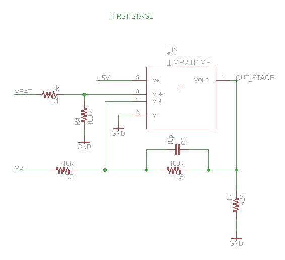
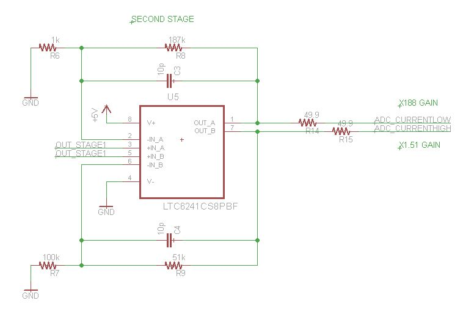
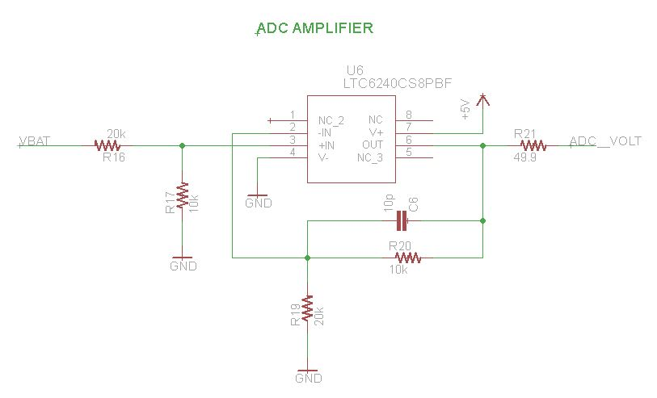
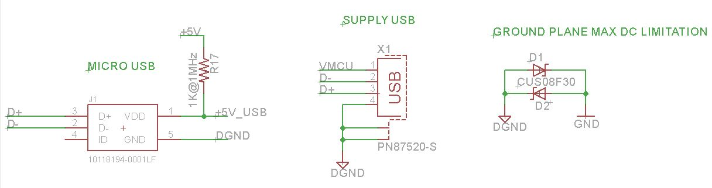
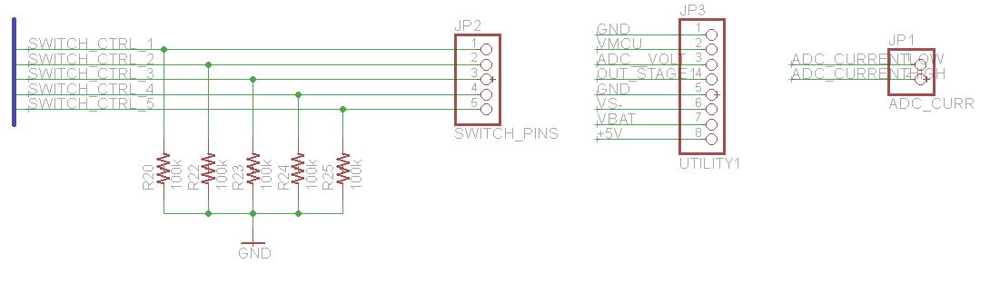

# PCB eagle schematics and boards for LMP2011

LMP2011 is a precision OPAMP. This device uses auto-zero techniques to continually correct the input offset error voltage. The input offset is 60uV in the worst case scenario,  0.8uV typically. Furthermore has a typical CMRR of 130dB, its minimum is 95dB.

## Notations
* Current Measuring Board (CMB): PCB with the designed circuit that can measure shunt voltage, and supply voltage.
* mcu: microcontroller connected to the CMB, its performs calibrations and translate the supply voltage and current measurements.
* Node: target mcu which power consumption the CMB is measuring.

## How to use

* Connect switch controllers (SWITCH_CTRL_1 to SWITCH_CTRL_5) to 5 different GPIO on any mcu.
* Connect low current, high current and supply voltage to 3 different ADC input in the mcu
* Power the CMB, either from the micro usb port or with 5V from an external power supply
* Bypass the targeted node power supply by either connecting it's power source to VBAT or the USB port on CMB.
* If the targeted node supply source is connected to VBAT then the node can be powered by connecting it's power input to VMCU, if it's USB powered a jumper must be connected between 5V and VBAT on CMB.

## Specifications:
- Power supply: 5V from USB port
- Current range: ~10uA - 50mA
- First stage gain: x100
- Second stage gain: x197 for low current, x1.51 for high current

## How version 2 works(detailed)

This board has a similar operation as the design using MAX4239, except that in this case the CMB does not include a DC booster (TODO: check if it is neccesary).

### Fist stage

The first stage amplifies the voltage difference in the shunt resistance through an OPAMP. R1, R2, R4 and R5 form a x100 gain between VBAT y VS-. R27 and C2 are added for stability purposes. 

### Second stage

The second stage has a LTC6241 high precision dual opamp. There are two current ranges with different gains:

- Low current range: 0uA-600uA, x197 gain
- High current tange: 600uA-50mA, x1.51 gain

These gains values adjust to the ADC input ranges. The 49.9 resistor are put in place to isolate the amplifier output and ADC input, thus preventing oscillation.

4 usually open analog switches are used for calibration in low current, this is done by measuring current flow threw resistors R9, R10, R13 and R14. TS5A23166DCUR switches where chosen for their high voltage input range, high max current and low Ron (0.8 ohms).

A normally closed switch is connected between the target node and it's supply source. The TS5A23167DCUR was chosen with similar characteristics as the TS5A23167DCUR.

C1 capacitor is connected between the supply source and ground to stabilize supply voltage from power source.

The buffer stage to measure the supply source uses a LTC6240 high precision amplifier with a x0.5 gain stage to allow supply voltage higher than the mcu supply (3.3V) to be converted with the ADC. This buffer stages also isolated the two.

As a supply source a microUSB type B female connector is used. This gives a 5V power supply. To reduce high frequency noise a high impedance, low frequency ferrite is used (1K@1Mhz).

A female type A USB connector can be used to power the targeted node. Analog and digital ground are separated by using two schottky diodes, CUS08F30 because of their high response and low activation voltage.

### Available connections

Multiple input/output pins are exposed to users: 

- SWITCH_CTRL_1: switch's on power supply for targeted node.
- SWITCH_CTRL_2 a 5: switches on or off calibration resistors.
- VMCU: output voltage that powers the targeted node it's short-circuited to the female type A USB.
- GND: ground
- OUT_STAGE1: first amplifying stage gain output, for debugging purposes.
- VS-: shunt resistor low voltage pin.
- VBAT: pin where targeted node supply voltage is connected to bypass it.
- +5V: 5V output, its separated from the USB by the ferrite. de 5V, separada de USB por la ferrita.

# Board versions

## LMP2011 V1 - Fabricated
This version of the board was manufactured with [OSHPARK](https://oshpark.com/). Soldering and testing was done at Inria Chile office.

### Overview

This board needs a 5V supply for most of the IC, LMP2011 get supply from a DC booster in the CMB.

The first stage is a differential amplifier with x10 gain, the second stage has a low current stage with x197 gain and a high current range with x1.51 gain.

To read supply voltage a x0.5 buffer stage is used.

Analog and digital ground are separate with schottky diodes.

5V supply source is filtered with a 1k@1MHz ferrite.

USB enclosure is connected to the digital ground.

### Testing conclusions

#### Remarks
- Manufactured board
- Soldered components
- All IC had correct supply and GND connections
- There is an error in power supply for the LMP2011 design: it can't be supply from 8v68. MIC2250 is not connected and bypass 5V to the supply pin of the IC.
- There aren't conclusive results from the circuit. The CMB with this IC does not work as it should, neither in a breadboard.

#### TODO
- Check connections in LMP2011
- Check real measurement range
- Make reading with a mcu. Calibrate and control of the switches

#### Issues
- LMP2011 not working correctly
- The gain in low current stage should be x197, not x19.7 10K resistance should be a 1K
- Control switch for node supply are not connected well. This was fixed soldering directly from the inputs of the switch
- Ad
- VBAT and VADC silkscreen names are misplaced, they are switched.
- There are no pull-down resistors in the control switch

#### To improve
- CMRR by using higher tolerance resistor values, at least 0.1%. This can also be done by incrementing the stages gain, but this affects the current ranges
- Change USB port from SMD to thru-hole to improve robustness in the pcb
- Different configurations for the first stage should be considered

## LMP2011 V2 - not manufactured

This version of the board should solve the issues from the last version manufactured.

* Remove DC booster (Check supply needed from the IC)
* Low current gain is addressed by changing 10K resistors to 1K
* Switch connection is fixed
* Pull down resistors are included for the switches

There is only the schematic for this board, not the board design yet
