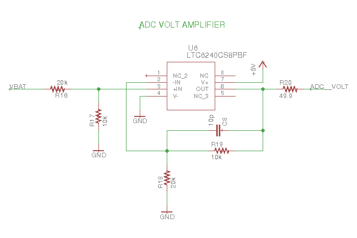

# PCB eagle schematics and boards for MAX 4239

MAX4239 is a auto-zero amplifier, with low input voltage offset of 1.0uV (typical) and 2uV (full temp range), it also has a high CMRR of 120dB (min), 140dB (typ).

### Some notation
* current measuring board (CMB): the designed circuit that measure shunt voltage, and supply voltage.
* mcu: the microcontroller that is connect to the CMB, performs calibrations and converts the supply voltage and current measurements.
* node: the target mcu which pwoer consumption the CMB is measuring.

### How to use

* connect switch controllers (SWITCH_CTRL_1 to SWITCH_CTRL_5) to 5 different GPIO on any mcu.
* connect the low current, high current and supply voltage output to 3 different ADC inputs on your mcu.
* power the CMB by either connecting it to it's microUSB port ore the 5V supply pin.
* bypass the targeted node power supply by either connecting it's power source to VBAT or the USB port on CMB.
* if the targeted node supply source is connected to VBAT then the node can be powered by connecting it's power input to VMCU, if it's USB powered a jumper must be connected between 5V and VBAT on CMB.

### Ratings V2:
- Power supply: 5V from USB
- Current range(ideal): ~1uA - 50mA
- First stage gain x10
- Second stage gain x197 for low currents and x1.51 for high currents.

### Ratings V3:
- Power supply: 5V from USB
- Current range(ideal): ~1uA - 50mA
- First stage gain x100
- Second stage gain x19.7 for low currents and x0.151 for high currents.

### MAX4239 V3 (detailed)

The first stage amplifies the voltage measured at the shunt by applying a differential gain. R1, R2, R4 & R5 form a x100 gain. R6 and C3 are added for stability, C3 also helps to reduce currents peaks. C2 stabilizes the power supply.

The second stage is conformed by a dual LTC6241 high precision opamp. There are two current ranges with to different gains:

- Low current range: 0uA-600uA, x197 gain
- High current range: 600uA-50mA, x 1.51 gain

These gains values adjust to the ADC input ranges. The 49.9 resistor are put in place to isolate the amplifier output and the ADC input, thus preventing oscillation.

4 analog switches (usually open are) used for calibration, this is done by measuring current flow threw resistors R9, R10, R13 and R14. TS5A23166DCUR switches where chosen because of the high voltage input range, high max current and low Ron (0.8 ohms).

A normally closed switch is connected between the target node and it's supply source. The TS5A23167DCUR wash chosen with similar characteristics as the TS5A23167DCUR.

C1 is connected between the supply source and ground to stabilize it.

The buffer stage to measure the supply source uses a LTC6240 high precision amplifier with a x0.5 gain stage to allow supply voltage higher than the mcu supply (3.3V) to be converted. This buffer stages also isolated the two.

As a supply source a microUSB type B female connector is used. This supply a 5V power supply. To reduce high frequency noise a high impedance, low frequency ferrite is used (1K@1Mhz).

A female type A USB connector can be used to power the targeted node. Analog and digital ground are separated by using two schottky diodes, CUS08F30 because of their high response and low activation voltage.

Multiple input/output pins are supplied (R21 to R25 are pull down resistors so calibration resistors and node supply are normally turned off). These are:

- SWITCH_CTRL_1: switch's on power supply for targeted node.
- SWITCH_CTRL_2 a 5: switches on or off calibration resistors.
- VMCU: output voltage that powers the targeted node it's short-circuited to the female type A USB.
- GND: ground
- OUT_STAGE1: first amplifying stage gain output, for debugging purposes.
- VS-: shunt resistor low voltage pin.
- VBAT: pin where targeted node supply voltage is connected to bypass it.
- +5V: 5V output, its separated from the USB by the ferrite.

MAX4239 maximum supply voltage is 6V & it's differential inputs can only take inputs 0.3V bellow its supply voltage. It has been observed that for 5V inputs in one of the differential inputs the MAX4239 voltage output oscillates. This is fixed by using a MIC2250 booster to boost supply to 5.5 volts. The configurations used is the one recommended by manufacturer.

# Board versions

## MAX4239 V1 (not fabricated)

Schematic is almost the same as version 2, in terms of functionalities. It just has a bigger size and laxer design rules.

## MAX4239 V2 (fabricated)

This board version was fabricated with oshpark. Soldering and testing was done at Inria Chile IoT-LAb.

### Details

This board version considers a 5V supply for all IC which is supplied by the microUSB connector.

The first stage is a differential amplifier with x10 gain, the second stage has a low current stage with x197 gain and a high current range with x1.51 gain.

To read supply voltage a x0.5 buffer stage is used.

Analog and digital ground are separate with schottky diodes.

5V supply source is filtered with a 1k@1MHz ferrite.

USB enclosure is connected to the digital ground.

### Prototyping and testing conclusion

#### Remarks
- manufactured board
- soldered components, ok
- all IC had correct supply and GND connections
- testing consumption with different loads currents from 600uA to 50mA have been correctly measured, lower current values can be measured but it calibration valued haven't been checked
- calibrations values have been obtained, fidelity of the calibrated readings hasn't been verified

#### TODO
- Verify effective measuring range.
- Verify the whole pipeline from mcu to node.
- A new version that solves all V2 issues but doesn't change the stages gain should be implemented.

#### Issues
- When a 5V power supply is used for the first gain stage some oscillations have appeared. The problem was solved using a 5.5V supply for this stage (or higher).
- C2 condenser was wrongly placed. It can be removed at it's shorted for the board to work.
- The first low current gain stage should be 197 and not 19.7, the 1k resistor should be changes by a 10k resistor.
- Targeted node power control switches are wrongly connected. This was fixed by soldering the two inputs for these switches. (the right one was not connected do SWITCH_CTRL_1).
- Pull-down resistors so default calibration resistors and power targeted node supply is off.
- VBAT and VMCU silkscreen names are misplaced, they are switched.

#### To improve
- CMRR by using higher tolerance resistor values, at least 0.1%. This can also be done by incrementing the stages gain, but this affects the current ranges
- In the fabricated board the supply switch pins must be soldered to allow proper enabling and disabling of these (this is not the case for V3)
- Different configurations for the first stage should be considered

## MAX4239 V3 (not fabricated)

This version addressed all the issues pointed out for V2
* DC booster is used to bump MAX4239 power source from 5V to 5.5V
* C2 is correctly placed
* Low current gain is addressed by changing 10K resistors to 1K
* Switch connection is fixed
* Pull down resistors are included for the switches
